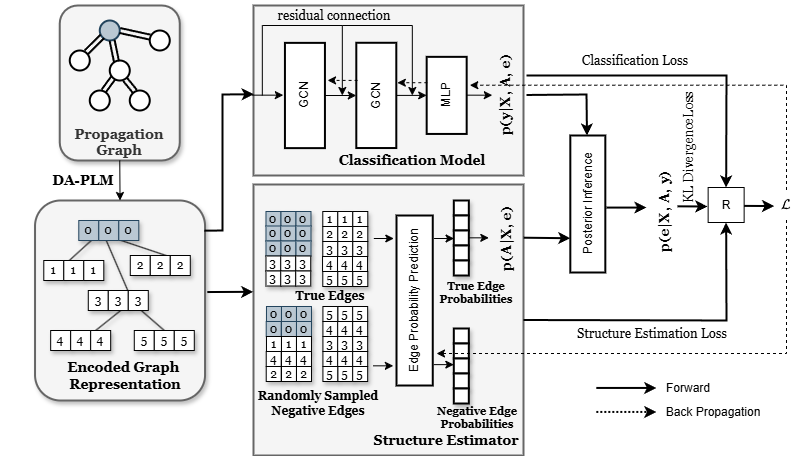

# FNDCD

Official implementation of WWW'25 [&lt;Unseen Domain Fake News Detection Through Causal Debiasing&gt;](https://dl.acm.org/doi/10.1145/3701716.3715517)

## Abstract
Fake News Detection via Causal Debiasing. As a plugging-in module on existing graph-based fake news detection, this model **FNDCD** adds a structure estimator and a posterior inference to debias the environment-biased samples in the training set. Experiments demonstrate that the FNDCD plugging on simple baselines achieves new state-of-the-art performance over a series of recent baselines on the unseen domain fake news detection (in an out-of-distribution scenario). 

## Model 

## Run

There are three selectable graph neural network backbones: BiGCN, GIN and GCNii; and two training data sources: Twitter and Weibo. 

To select the backbones and the training sources, follow the commands (e.g. training on Twitter dataset with BiGCN backbone) 

`
python main --gnn_model 'BiGCN' --data_source 'Twitter'
`

Trained models will be evaluated on Twitter-COVID19 and Weibo-COVID19 datasets. 
