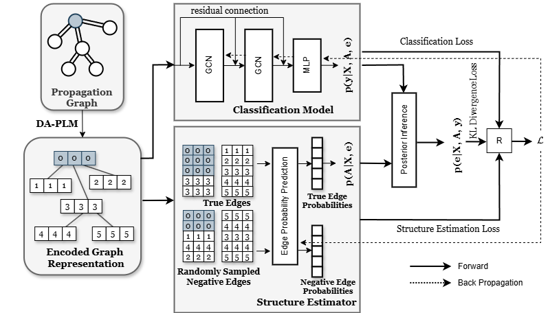

# FNDCD

Official implementation of WWW'25 [&lt;Unseen Domain Fake News Detection Through Causal Debiasing&gt;](https://dl.acm.org/doi/10.1145/3701716.3715517)

## Abstract
Fake News Detection via Causal Debiasing. As a plugging-in module on existing graph-based fake news detection, this model **FNDCD** adds a structure estimator and a posterior inference to debias the environment-biased samples in the training set. Experiments demonstrate that the FNDCD plugging on simple baselines achieves new state-of-the-art performance over a series of recent baselines on the unseen domain fake news detection (in an out-of-distribution scenario). 

## Model 

## Dataset and Reproduce
`
https://www.dropbox.com/sh/raz6unw2lswcy54/AADNsc-ifBoAfN1wwyVvgch-a?dl=0
`

Download the above datasets. Use `mkdir data` to create a new folder and unzip these datasets into the '/data' folder. 

You can retrieve the ids from these 4 datasets. In case you're not familar with the datasets, I've uploaded the ids in the '/data' folder. 

### Mini Version of the datasets

If you feel the datasets are too huge to download and only want some boot tests. Here is a mini (cropped) version of the datasets with only 100 earlier nodes in each propagation. 

`
https://drive.google.com/file/d/1mcEtlKV9-NJaZAKheR5NJeb1apFqwdb0/view?usp=sharing
`

## Run

There are three selectable graph neural network backbones: BiGCN, GIN and GCNii; and two training data sources: Twitter and Weibo. 

To select the backbones and the training sources, follow the commands (e.g. training on Twitter dataset with BiGCN backbone) 

`
python main --gnn_model 'BiGCN' --data_source 'Twitter'
`

Trained models will be evaluated on Twitter-COVID19 and Weibo-COVID19 datasets. 
